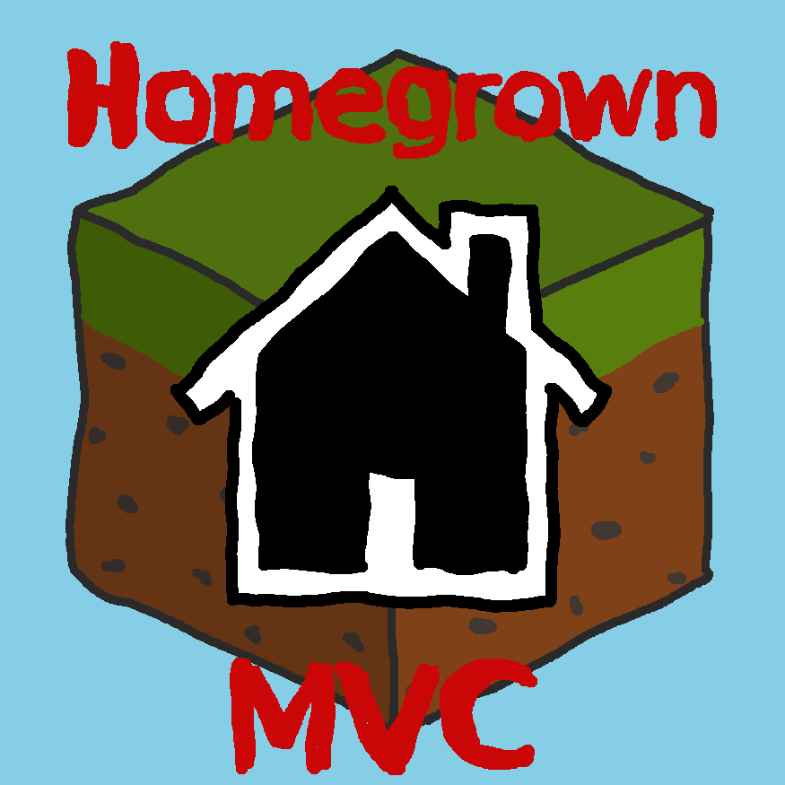

# Homegrown(MV)C
A very small MVC framework. Please see [HomegrownMVC Skeleton](https://github.com/konapun/HomegrownMVC-Skeleton) for a project starting point using the recommended setup below.

### Requirements
HomegrownMVC makes heavy use of closures and namespaces and therefore requires a PHP version >=5.3.0. Additional requirements will vary depending on your exact setup (database drivers, view engine requirements, etc.).

### Rationale
This is a router/controller microframework (with other optional elements) born out of necessity as I tried to make a legacy project
I inherited more manageable. The router/controller portion has no coupling to anything else (dependency injection is managed through the context),
and as a result should work with any templating system and DBAL.

## Recommended setup
Although Homegrown is written to be flexible and modular, it is known to work well with the following setup:
  * **router/controllers**: HomegrownMVC (read on for documentation for this portion)
  * **database**: [PDO](http://php.net/pdo)
  * **models**: [HomegrownMVC](Models.md)
  * **views**: [Smarty](http://www.smarty.net/)
  * **requests**: [HomegrownMVC](Request.md)

## Contexts
A context is just an object that bundles together the HTTP request, view engine, and database handle to be passed
to a controller. Since the context is an object you instantiate, you can use any class for any of these three parameters.
The context also holds a key-value stash which you can use to pass things around.
```php
$context = new HomegrownMVC\Context($httpRequest, $dbh, $viewEngine);

// Get properties set in constructor
$request = $context->getRequest();
$dbh = $context->getDatabaseHandle();
$view = $context->getViewEngine();

// Store in and receive from the stash
$context->stash('key', 'value');
$context->stash('key'); // returns 'value'
```

## Using routes
HomegrownMVC uses a router to locate controllers, but controllers are responsible for declaring the routes they handle.
```php
/*
 * This could be a snippet from your index.php file
 */

$context = new HomegrownMVC\Context($httpRequest, $dbh, $viewEngine);
$router = new HomegrownMVC\Router();

// Redirect example.com and example.com/ to example.com/home (without altering the URL)
$router->redirect('/', '/home');

// Associate routes with controllers. Controllers are custom custrollers you define which extend BaseController
$router->addController(new IndexController($context));
$router->addController(new SearchController($context));
$router->addController(new ErrorController($context));

// Handle the route. If no route is given, the current URL is used
if (!$router->handleRoute()) {
	$router->handleRoute('404'); // manually reroute to 404 defined in the error controller
}
```


Alternatively, the router can automatically locate and add controllers for you, given that
there is a single controller class per file and the controller class name is the same as
the file name, minus the .php extension.

```php
// Let the router locate, instantiate, and add the controllers for you
$router->autoloadControllers($context, 'controllers'); // the 2nd arg is the directory containing the controllers (default: 'controllers')

// Handle the route. If no route is given, the current URL is used
if (!$router->handleRoute()) {
	$router->handleRoute('404'); // manually reroute to 404 defined in the error controller
}
```

### Error handling in routes
By default, errors will be swallowed. This is useful to shield end-users from exceptions by invoking an error route in the case where an exception is thrown by a route. However, this can make debugging annoying; you can set the router to handle exceptions which are not of type `\HomegrownMVC\Error\RouteNotDefinedException` with your own custom handler. If you do not set your own handler, the default action is to echo the `errorMessage` to the page.

```php
$router = new HomegrownMVC\Router(true); // "true" sets debug mode to true - the router to uses an action for when exceptions are encountered
$router->handleException(function($exception) {
  echo $exception->getMessage() . "<br>\n"; // echo the exception message when an exception is encountered (this is the default action)
});
```

## Controllers
A HomegrownMVC controller extends the abstract BaseController class.
A controller only has to define actions for routes it accepts. Arguments
to the route are provided through the context

### Defining controllers
Currently, three types of controllers are defined:
  * **BaseController**: Routes are literal paths
```php
/*
 * Sample controller which is a regular BaseController
 */
class SearchController extends HomegrownMVC\Controller\BaseController {
		protected function setupRoutes() {
			$this->controllerBase('/search/');

			return array(
				'person' => function($context) { //maps to www.example.com/search/person
					$request = $context->getRequest();
					$view = $context->getViewEngine();

					// This will depend on the object you're using to do HTTP requests
					$name = $request->getParam('name');

					// This will depend on your view engine. You may use any, as this tiny framework doesn't provide one
					$view->replaceVar('name', "Searching for $name");
					$view->render();
				},
			);
		}
}
```

  * **WildcardController**: Routes can define wildcards to match
```php
/*
 * Sample WildcardController demonstrating the use of wildcards
 * in the routes
 */
class UserController extends HomegrownMVC\Controller\WildcardController {
		protected function setupWildcardRoutes() {
			$this->setWildcardCharacter(':'); // this is the default character, but you can change it to any single character
			$this->controllerBase('/user/');

			return array(
				':uid/profile' => function($context, $params) {
					echo "Showing profile for user with ID " . $params['uid'];
				},
				':uid/pictures/:pid' => function($context, $params) {
					echo "Showing picture with ID " . $params['pid'] . " for user with ID " . $params['uid'];
				}
			);
		}
}
```

  * **FrontController**: There are no routes but instead actions to run before and/or after a route is matched by the router. This controller is necessary for running actions that need to happen on every page, regardless of route and the controller that is invoked.
```php
/*
 * Sample FrontController demonstrating its use
 */
class WrapperController extends HomegrownMVC\Controller\FrontController {
  protected function setupFrontController() {
    $this->beforeFrontRoutes(function($context) {
      $dbh = $context->getDatabaseHandle();
      $view = $context->getViewEngine();

      $people = new People($dbh);
      $view->assign('administrators', $people->findByRole(People::ADMINISTRATOR)); // assuming the "administrators" variable needs to be displayed on every page
    });
  }
}
```

### Controller rerouting
A controller may conditionally reroute from one route to another. You may wish to do this if you have
implemented a RESTful API but do not want to build results through AJAX.
```php
class RerouteController extends HomegrownMVC\Controller\BaseController {
	protected function setupRoutes() {
		$that = $this;

		return array(
			'route1' => function($context) {
				echo "Doing route1";
			},
			'reroute_same_controller' => function($context) use ($that) {
				$that->invokeRoute('route1');
			},
			'reroute_different_controller' => function($context) {
				$searchController = new SearchController($context);
				$searchController->invokeRoute('/search/person?id=1234'); // invoke route as route string, params and all
			}
		);
	}
}
```
### Controller hooks workflow
When a route is matched, the following actions will be taken
  1. All `beforeRoute` actions will be executed in the order they are defined
  2. The matching route's action will be executed
  3. All `afterRoute` actions will be executed in the order they are defined

You may find it useful to use `beforeRoute` hooks for error checks, or in the case of an admin controller, checking to make sure the user is logged
in.

**If you want to terminate the workflow prematurely, simply return `false` from any callback.**

### Pre-route hooks
You may specify callbacks to run before a route is invoked using `beforeRoutes`. This is useful when, for example, you have a navigation controller
and want to set an active class depending on which nav route is invoked. You can stop the rest of the pre-route hooks from being called by returning
`false` from the callback
```php
class NavigationController extends HomegrownMVC\Controller\BaseController {
	protected function setupRoutes() {
		$this->beforeRoutes(function($context) {
			$view = $context->getViewEngine();
			$route = substr($context->getRequest()->routeName(), 1); // just remove the leading slash; since Homegrown(MV)C doesn't provide a Request class, your exact way of doing this will vary

			$view->replaceVar("$route-active", 'active'); // since Homegrown(MV)C doesn't provide a view engine, your exact way of doing this will vary
		});

		return array(
			// ...
		);
	}
}
```

### Post-route hooks
These are just like pre-route hooks but fire after a route is invoked. Just as before, you can return `false` to terminate running the rest of the post-route callbacks
```php
class TestController extends HomegrownMVC\Controller\BaseController {
	protected function setupRoutes() {
		$this->afterRoutes(function($context) {
			$view = $context->getViewEngine();

			$viewEngine->render();
		});
	}
}
```

## Working with the stash
The context's stash is a general-purpose key/value store. Because the same context is used between
the route action and the pre/post route hooks, using the stash to store values to be shared between
these functions is ideal.
Here is an example of using the stash to store a forward route for a route that requires a login:
```php
class AdminController extends HomegrownMVC\Controller\BaseController {
	protected function setupRoutes() {
		$this->controllerBase('/admin/');

		$that = $this;
		$user = UserModel::getInstance();
		return array(
			'login' => function($context) use ($that, $user) {
				$forwardRoute = $context->stash('forward-route') or '/admin/overview';
				if ($user->isLoggedIn()) {
					$that->invokeRoute($forwardRoute);
					return;
				}
				else {
					// authenticate user
					// ...

					// user has been authenticated by this point, so redirect them to the page they were trying for
					$that->invokeRoute($forwardRoute);
				}
			},
			'viewUsers' => function($context) use ($that, $user) {
				if (!$user->isLoggedIn()) {
					$context->stash('forward-route', '/admin/viewUsers');
					$that->invokeRoute('/admin/login'); // after authentication, login will invoke this route
					return;
				}
				// ...
			},
			'overview' => function($context) {
				// ...
			}
		);
	}
}
```
and sharing between functions:
```php
class ContextExampleController extends HomegrownMVC\Controller\BaseController {
	protected function setupRoutes() {
		$this->beforeRoutes(function($context) {
			$context->stash('key', 'val');
		});
		$this->afterRoutes(function($context) {
			echo "After route, still have stashed val " . $context->stash('key');
		});
		return array(
			'/home' => function($context) {
				echo "Preroute: stashed " . $context->stash('key');
				// can also stash more stuff here to use in the afterRoutes callback
			}
		);
	}
}
```

You can also share data between routes using `$req->setFieldValue('field', 'value')` if you're
using HomegrownMVC\Request\HTTPRequest for your request provider.

## Models
HomegrownMVC comes with an optional models framework (though you can use whatever you'd like) and distinguishes between a model schema and a model collection. Models can be converted into hashes in order to be easily consumed by the view layer.

### Plural models / Fixture models (collection)
Plural models are collections which extend
`HomegrownMVC\Model\PluralModel` (for models which connect to a real database) or
`HomegrownMVC\Model\FixtureModel` (for models which provide their data in-place as native PHP structures or
load their data from flat files). The main purpose of plural models is to vivify singular models and provide
methods for filtering the collection (`findByName`, `findByID`,  etc.). Every plural model must implement
a protected function called `setupData` which returns an array of hashes whose keys correspond to the field
names specified by a singular model. Most of the models in this project are `FixtureModel`s which load their
data from CSV files in `models/data` using `HomegrownMVC\Model\DataImporter\CSVDataImporter` (see almost any
plural model for examples).

### Singular models (schema)
Singular models specify the object schema by implementing a protected function called `listProperties` which
returns an array of property names required to build an object of this instance. A singular model can also
specify its means for construction by providing an implementation for a protected function `setupBuilders`
which returns a mapping of keys to functions which provide an instantiation upon that key.

    // Example setupBuilders function for Person.php
    protected function setupBuilders($dbh) {
      $people = new People($dbh);
      return array(
        'id' => function($id) use ($people) {
          return $people->findByID($id);
        }
      );
    }

    // An example of instantiating a singular model with ID 0
    $foundPerson = new Person($dbh, array(
      'id' => 0 // Here we use the ID builder specified above
    ));

#### Extended CSV
Data files are given in an extended CSV format which is normal CSV with the following addition: You may link
text from other files as a field value by adding the `file:` prefix before giving the filename.

For example, if you had a long person bio you didn't want to embed directly into the CSV file, you could
place it externally as a file named "person_bio.txt" and include the text from that file into the field by
doing

    file:person_bio.txt

You can constrain included files to a certain directory when using this feature by restricting its usage to files contained
within the `models/data/text` directory so when specifying the file to link, specify it relative to this
directory (e.g. models/data/text/person_bio.txt would be given as `file:person_bio.txt`)
